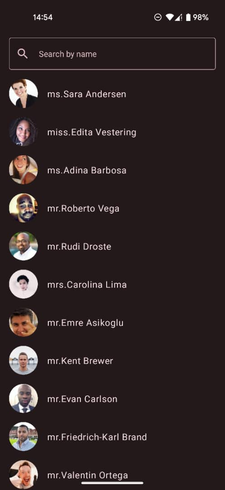
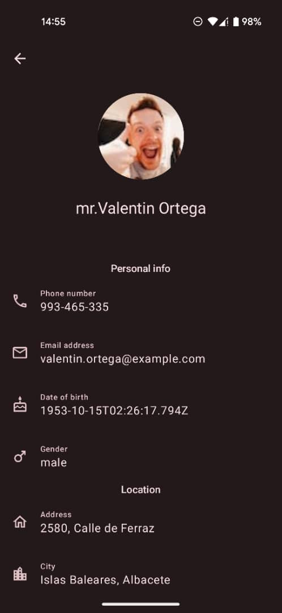

# yobi-test

## Project setup

    
    

The project runs on the following setup:

- Android Studio Giraffe | 2022.3.1 Patch 1
- Gradle Version 8.0
- Android Gradle Pluguin Version 8.1.1
- Tested on : Pixel 4a device, Emulator Pixel5 API 33

You can get a generated apk-debug file from this [link](https://drive.google.com/file/d/1AxzgSbtKNhl-OLDgGDQz0IDAGeAS1bIT/view?usp=sharing).

## Architecture
This app uses MVVM architecture and follows [Guide to app architecture](https://developer.android.com/topic/architecture).

## libraries and solution

- [Jetpack Compose](https://developer.android.com/jetpack/compose)
- [Navigation components with compose library](https://developer.android.com/jetpack/compose/navigation). Every screen has its navigation logic abstracted into a separate file following [Type safe, multi-module best practices with Navigation Compose
](https://www.youtube.com/watch?v=goFpG25uoc8&t=256s).
- [Dependency injection with Hilt](https://developer.android.com/training/dependency-injection/hilt-android)
- [Lifecycle](https://developer.android.com/jetpack/androidx/releases/lifecycle)
- [Paging library](https://developer.android.com/topic/libraries/architecture/paging/v3-overview)
- [Kotlin coroutines](https://developer.android.com/kotlin/coroutines)
- [Retorift](https://square.github.io/retrofit/)
- [Moshi](https://github.com/square/moshi)
- [OkHttp](https://square.github.io/okhttp/)
- [Coil](https://coil-kt.github.io/coil/)

  ## Some things that should be considered in a production environment
  - Testing: In this project different forms of testing were ommited due to time scarcity. In a production environment they need to exist.
  - Hiding API keys: For simplicity, the API key (app-id) used in this project is provided in the codebase. In production environments they need to be hidden and fetched at build time (using secrets.properties and BuildConfig).
  
   And other features that are more obvious like:  splash screen, app icon, better user interface, documentation, better gradle dependency management...etc
